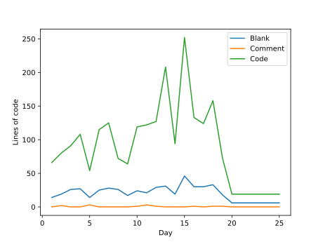
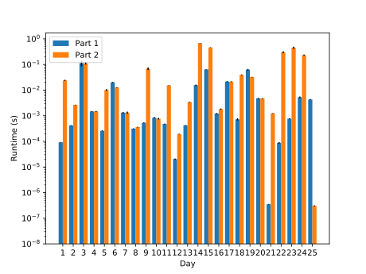

# Advent of Code 2018

Once again, I will be attempting to complete the challenges in Rust.
However, this this I will be focussing on having idiomatic code and
having everything in a single executable.

To run day 1: `cargo run -- 1`. Other options can be seen with the
`--help` flag. The program will by default read its input from stdin.

## Correctness

All of this year's solution implementations have some semblance of unit
tests, all coming from the examples given in the problem statement.
These tests are checked by travis (if you haven't noticed the shiny
button above) on stable, beta and nightly Rust, as well as the version
of Rust that Ubuntu Xenial ships.

## Simulations

This year's edition is very simulation-heavy. Thus, code written for
those days tends to be very long. To illustrate this, I have created the
graph below. Can you guess which days had a large simulation?

The code to produce this graph is included in the `other` directory, and
should be compatible with most peoples repo set-ups, so you can share
your pain. If it is not, please let me know.

## Performance

I benchmarked the performance of my implementations on stable rust
(1.31.1 at the time of writing). The logarithmic runtime graph looks as
follows:

